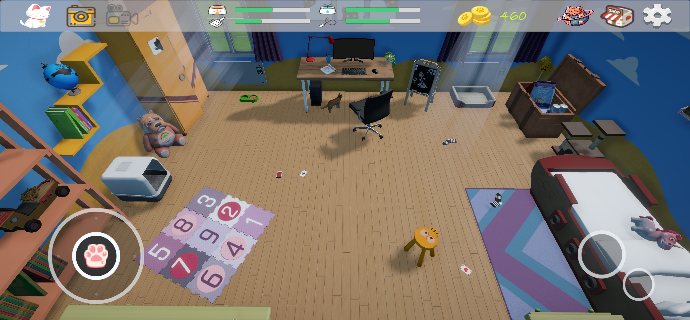
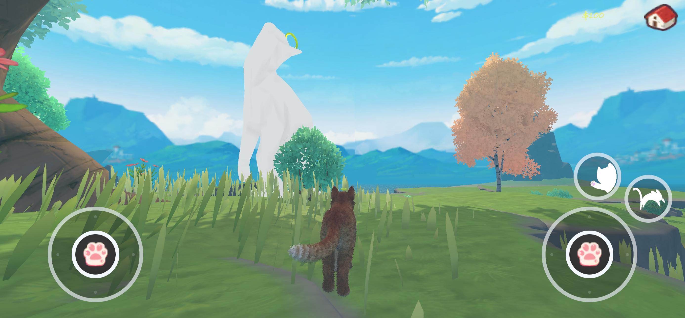
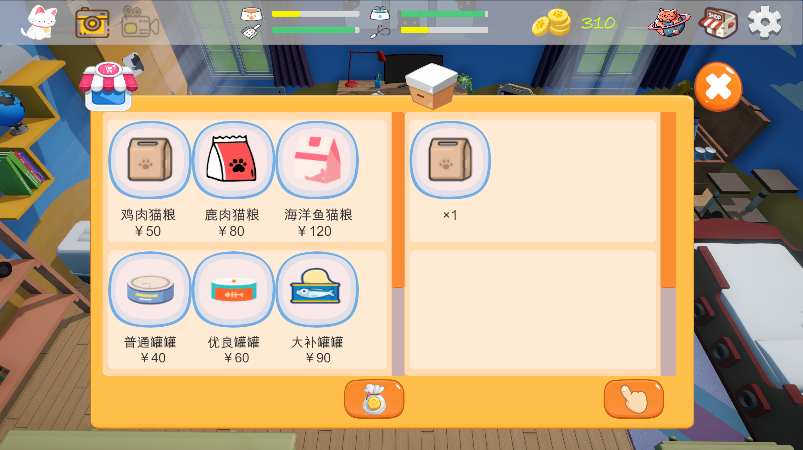
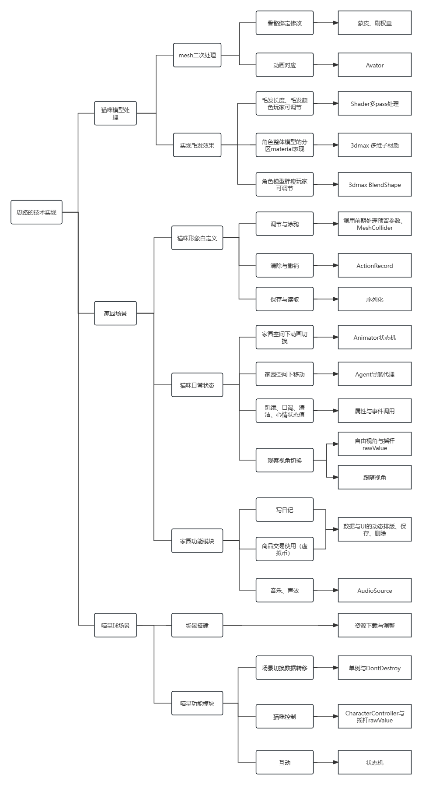
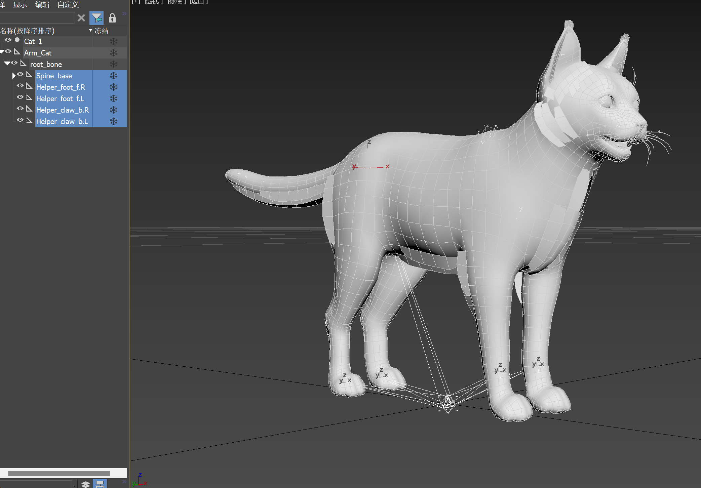
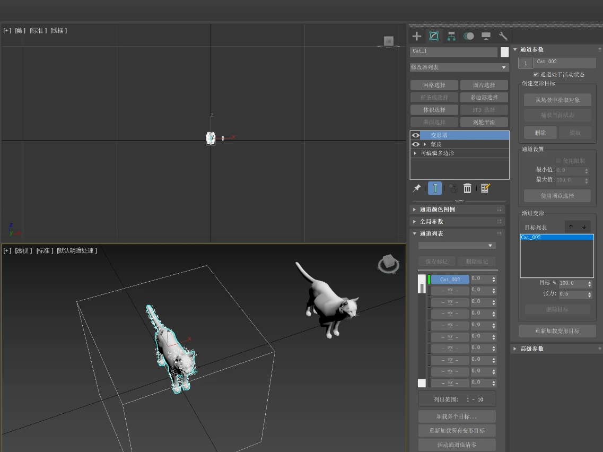
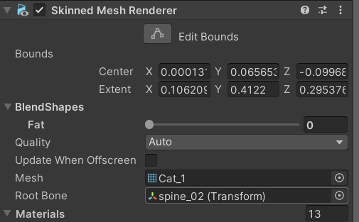
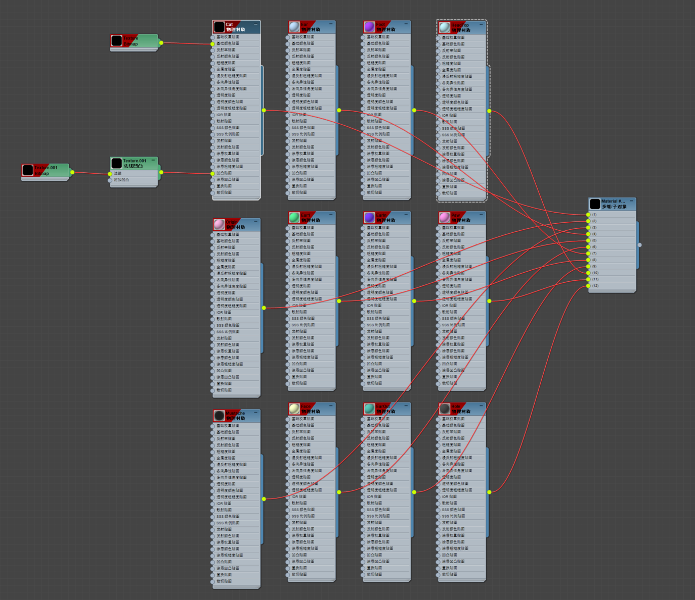
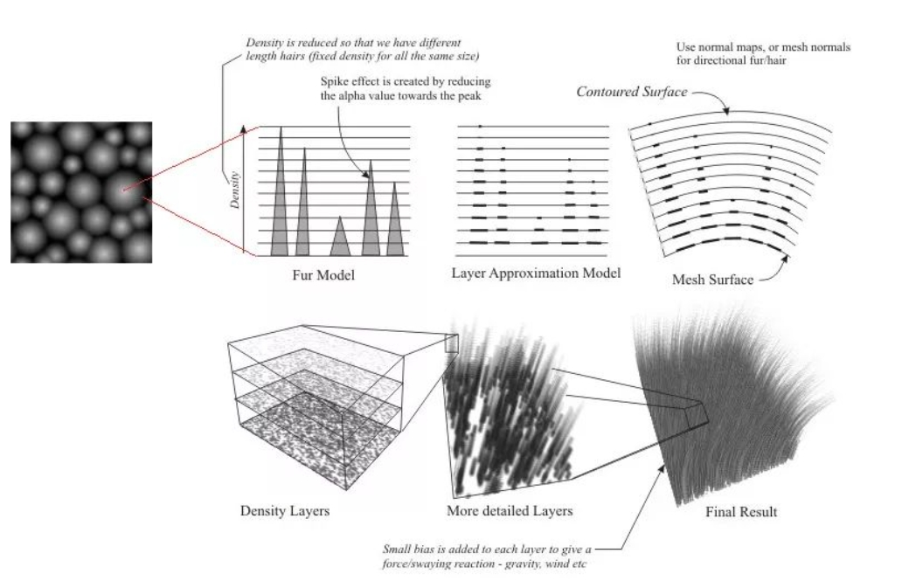

# 个人游戏开发实现作品集
# 目录
- [1.游戏简介](#游戏简介)
- [2.策划思路](#策划思路)
- [3.技术路线](#技术路线)
  - [3.1技术总图](#技术总图)
  - [3.2模型处理](#模型处理)
  - [3.3毛发效果](#毛发效果)
# 游戏简介

  
爪印（PawPrint）是写给那些现实生活中失去自己爱猫人群的治愈经营游戏。无论猫咪是自然离世、生病去世、亦或是无声无息的离开，喵星人带给人的温暖永远不会消失。希望通过这个works可以带给人们慰藉，世界破破烂烂，小猫缝缝补补。 
PawPrint is a healing game for people who have lost their cats in real life. Whether your cat dies naturally, gets sick, or leaves without a word, the warmth that cats bring to you will never die. I hope this works can bring people comfort, the world is in tatters, and kittens are mending.

# 策划思路
策划路线：以休闲运营为主调，设计家园场景和喵星球场景。在家园场景中实现喂养清洁陪伴、DIY自定义猫形象、日记记录等功能，喵星球场景中实现自由探索功能。以手游为目标，后期移植pc。将受众人群的心理期待为主线，尽可能多的体现人与猫之间的纽带，弱化人的控制，尽可能多的还原猫咪日常状态。  
Planning route: Focus on leisure operation, design home scene and Meow planet scene. In the home scene, the functions of feeding and cleaning, DIY custom cat image, diary recording and so on are realized, and the function of free exploration is realized in the cat planet scene. Target mobile games as the target, later transplant pc. The goal is to take the psychological expectations of the audience as the target, to reflect the bond between people and cats as much as possible, weaken the control of people, and restore the daily state of cats as much as possible.  

# 技术路线
## 技术总图

## 模型处理
猫角色的模型的的创建主要考虑了三个因素，一是猫咪角色的形象还原，二是摈弃之前游戏创作时一味想亲身体验从建模到骨骼绑定、刷权重、做动画导致的体力时间浪费，三是能兼顾性能优化和配合shader毛发片元挤出的质量观感的中低模，决定从网上直接找mesh和骨骼动画合格的产品。  
原模型在Avator动画传递时发现后腿部变形严重，骨骼绑定需要修改（还好不算多，否则直接abandon了）。

制作猫咪模型胖瘦变化，对比了权重贴图、blendshape等几种方法，最后决定用blendshape在3dmax里调整好mesh角点的缩放极值，导出参数在unity通过调值来动态控制猫咪胖瘦。这一技术多用于表情变化与捏脸中，在《爪印》中刚好能契合简单的形体变化需求，每次改变后再bake一次就行，因为是中低模，此处的性能消耗可以直接忽略。

  
该模型材质默认整体统一，但为了后期配合毛发shader在不同部位的生长情况不同（眼睛、爪垫、耳内、鼻子等位置是不长毛的，且脸部、头顶、躯干、四肢毛发稀疏、长度也不同），所以需要将整体材质进行拆分。这里用多维子材质功能在3dmax中提前将不同部位材质区进行分割，方便后期多个shader对应各自部位进行分开调整来达到我想要的效果。
  
## 毛发效果
在想要做出毛发前，查阅了大量文献和资料。最初是想做出《动物派对》的毛发自然效果，但是考虑了该游戏发布将手机端放在首位，所以借鉴了《王者荣耀》中妲己的尾巴的毛发效果。该shader是在urp下成型的通过片元挤出,多pass层间断生成来达到毛发的散射加透光的效果。原理图如下：  
  
这个shader我研究了比较久，在确定使用这个shader之前，我自己有写一个有权重贴图的shader想达到效果，但是在从vert传递涂鸦操作时的精准纹理坐标到frag总是报错，一是geom中不能进行纹理采样，二是像素着色器中二次修改顶点坐标是不可能的。所以最后直接采用了妲己毛发shader进行部分修改：
手指涂抹猫的mesh的区域进行涂色的信息进行记录，之后在将这些区域和颜色对shader的baseTexture重新SetPixels，这样能绕开在shader中坐标过渡不精准的output._FurWeight = SAMPLE_TEXTURE2D(_FurWeightMap, sampler_FurWeightMap, uvWeight).r类似问题。  
最后思路：调用基础贴图的像素进行渲染，玩家涂鸦的功能通过外部的baseTexture指定这个shader使用。这样整体颜色、涂鸦颜色的问题可以一起解决。  
此外毛发长度、毛发疏密、毛发层数直接用参数调用，配合前期的多维子材质分块进行动态调整，就能达到想要的效果了。  
但是毛发层数是个很耗性能的drawcall，在调整毛发效果时尽量调节间距而不是单纯增加层数，来达到长毛的效果。最终效果如下：  

