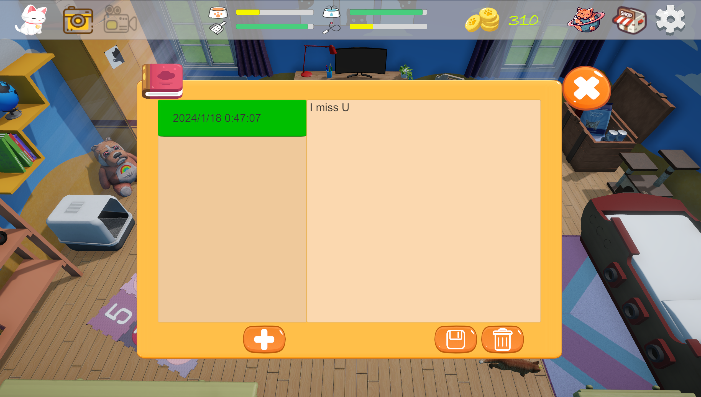

# 个人游戏开发实现作品集
# 目录
- [1.游戏简介](#游戏简介)
- [2.策划思路](#策划思路)
- [3.技术路线](#技术路线)
  - [3.1技术总图](#技术总图)
  - [3.2模型处理](#模型处理)
  - [3.3毛发效果](#毛发效果)
  - [3.4形象自定义](#形象自定义)
  - [3.5状态切换](#状态切换)
  - [3.6日记记录](#日记记录)
  - [3.7商品交易](#商品交易)
  - [3.8自由探险](#自由探险)
  - [3.9模块功能](#模块功能)
# 游戏简介

  
爪印（PawPrint）是写给那些现实生活中失去自己爱猫人群的治愈经营游戏。无论猫咪是自然离世、生病去世、亦或是无声无息的离开，喵星人带给人的温暖永远不会消失。希望通过这个works可以带给人们慰藉，世界破破烂烂，小猫缝缝补补。 
PawPrint is a healing game for people who have lost their cats in real life. Whether your cat dies naturally, gets sick, or leaves without a word, the warmth that cats bring to you will never die. I hope this works can bring people comfort, the world is in tatters, and kittens are mending.

# 策划思路
策划路线：以休闲运营为主调，设计家园场景和喵星球场景。在家园场景中实现喂养清洁陪伴、DIY自定义猫形象、日记记录等功能，喵星球场景中实现自由探索功能。以手游为目标，后期移植pc。将受众人群的心理期待为主线，尽可能多的体现人与猫之间的纽带，弱化人的控制，尽可能多的还原猫咪日常状态。  
Planning route: Focus on leisure operation, design home scene and Meow planet scene. In the home scene, the functions of feeding and cleaning, DIY custom cat image, diary recording and so on are realized, and the function of free exploration is realized in the cat planet scene. Target mobile games as the target, later transplant pc. The goal is to take the psychological expectations of the audience as the target, to reflect the bond between people and cats as much as possible, weaken the control of people, and restore the daily state of cats as much as possible.  

# 技术路线
## 技术总图

## 模型处理
猫角色的模型的的创建主要考虑了三个因素，一是猫咪角色的形象还原，二是摈弃之前游戏创作时一味想亲身体验从建模到骨骼绑定、刷权重、做动画导致的体力时间浪费，三是能兼顾性能优化和配合shader毛发片元挤出的质量观感的中低模，决定从网上直接找mesh和骨骼动画合格的产品。  
原模型在Avator动画传递时发现后腿部变形严重，骨骼绑定需要修改（还好不算多，否则直接abandon了）。

制作猫咪模型胖瘦变化，对比了权重贴图、blendshape等几种方法，最后决定用blendshape在3dmax里调整好mesh角点的缩放极值，导出参数在unity通过调值来动态控制猫咪胖瘦。这一技术多用于表情变化与捏脸中，在《爪印》中刚好能契合简单的形体变化需求，每次改变后再bake一次就行，因为是中低模，此处的性能消耗可以直接忽略。

  
该模型材质默认整体统一，但为了后期配合毛发shader在不同部位的生长情况不同（眼睛、爪垫、耳内、鼻子等位置是不长毛的，且脸部、头顶、躯干、四肢毛发稀疏、长度也不同），所以需要将整体材质进行拆分。这里用多维子材质功能在3dmax中提前将不同部位材质区进行分割，方便后期多个shader对应各自部位进行分开调整来达到我想要的效果。
  
  
## 毛发效果
在想要做出毛发前，查阅了大量文献和资料。最初是想做出《动物派对》的毛发自然效果，但是考虑了该游戏发布将手机端放在首位，所以借鉴了《王者荣耀》中妲己的尾巴的毛发效果。该shader是在urp下成型的通过片元挤出,多pass层间断生成来达到毛发的散射加透光的效果。原理图如下：  
  
这个shader我研究了比较久，在确定使用这个shader之前，我自己有写一个有权重贴图的shader想达到效果，但是在从vert传递涂鸦操作时的精准纹理坐标到frag总是报错，一是geom中不能进行纹理采样，二是像素着色器中二次修改顶点坐标是不可能的。所以最后直接采用了妲己毛发shader进行部分修改：
手指涂抹猫的mesh的区域进行涂色的信息进行记录，之后在将这些区域和颜色对shader的baseTexture重新SetPixels，这样能绕开在shader中坐标过渡不精准的output._FurWeight = SAMPLE_TEXTURE2D(_FurWeightMap, sampler_FurWeightMap, uvWeight).r类似问题。  
最后思路：调用基础贴图的像素进行渲染，涂鸦的功能我通过外部的baseTexture指定这个shader使用。这样整体颜色、涂鸦颜色的问题可以一起解决。  
此外毛发长度、毛发疏密、毛发层数直接用参数调用，配合前期的多维子材质分块进行动态调整，就能达到想要的效果了。  
但是毛发层数是个很耗性能的drawcall，在调整毛发效果时尽量调节间距而不是单纯增加层数，来达到长毛的效果。最终效果和参数代码如下：  
  
  
 
 
 
初始化毛发效果做好后，也同时留好了调整毛发长度、整体毛色预设和自定义、涂鸦颜色的接口了，之后UGUI控件和涂抹来调整的空间就留给玩家了。
 

## 形象自定义
猫咪胖瘦、毛发长度两项参数玩家通过slider控制，其中猫咪胖瘦调整后会重新bake确保形体坐标一致。整体毛发颜色可采用预设的橘猫、狸花猫、奶牛猫等几种贴图一键设置，也可以独立在colorPanel选择颜色进行整体毛发颜色更换。涂鸦为选择颜色后在猫身上对应区域进行涂抹。这些操作会进行actionRecord的记录，来帮助玩家撤销、清除或保存自己的操作。  
保存毛发信息的方法因为像素数组容量大每次保存会轻微卡顿，故采用异步保存的方式，将主程中的毛发颜色参数单独提出去在外部进行序列化，可节省计算时间。  
在处理用户涂抹时指头离开的方法中遇到无法在确定触摸为true中监控变为flase的事件，采用协程的方式来处理。协程在该游戏中有大量使用，除了DOTween外，在处理时间线需要判定时，协程能较方便的进行判定和触发。  
## 状态切换
游戏在家园场景中设计了猫咪可以自由在屋子里进行随机行走、奔跑、伸懒腰、舔爪、休息、吃饭、喝水等移动和动画，因为我此处想还原猫咪的自由状态，弱化玩家的控制，来轻松的带给玩家猫咪还陪伴在身边的真实感。  
首先给家园场景中生成导航代理的区域作为猫咪的活动空间，为了减少穿模的视觉劣质感，需将Agent区域的半径设置和猫的boundingbox大致一致。之后猫的移动依靠在代理区域内随机生成坐标位置驱动Agent的SetDestination来代理猫咪进行移动。  
动画部分采用Animator来链接不同动画触发与结束，形成移动动画和原地动画，例如行走、奔跑到房间内某处，躺下伸懒腰、坐下发呆、饥饿口渴值为零时加粮加水会奔跑到饭碗处进食喝水等状态切换。此处用方法调用移动代理与Animator来实现随机的猫咪状态切换。
 
 
 
 
 
 
 
## 日记记录
考虑到最初设计的受众玩家的情感互动需求，我想加入一些能够寄托感情的功能。最初规划了几个功能：上传和猫咪的合照、写日记、访问别人的家园和公开日志、调用chatGPT的API预训练一个模型代替去世的猫咪角色和玩家进行对话等，能够完善治愈系这个主题。无奈做到这里的时候我的本职工作太忙了，规划时间不够，只能选取日记记录这个最简单的功能来做。一个个人游戏开发者的无奈吧。  
在日记记录这个功能中，玩家的思念、遗憾等都可以在日记本面板中写下来，日记内容通过序列化和反序列化保存和读取，供玩家随时查看。
 
## 商品交易
为了模拟日常生活中给猫咪购物喂食添水场景需求，做了这个商品交易功能。点击商店或房间内的箱子模型，可以进入商店与储藏界面。在这里，玩家可以通过点击对应的猫粮、罐头、猫条等商品进行购买，购买后的商品存储在个人仓库中，点击对应的商品进行投喂。同时也可以点击猫砂盆触发清洁动画进行铲屎清洁，这些功能同时和猫的饥饿、口渴、清洁、心情状态值进行绑定，来完成玩家保持爱猫最好状态的动态需求。其中金币为是在另一个喵星球场景中进行赚取，也是为了促进玩家在两个场景中多切换进行体验。  
这部分中功能实现和上条大同小异，多为数据传递与存储。大部分时间都花在UI的Panel、Scroll View和Viewport的处理上了。
 
## 自由探险
这个游戏设计了喵星这个场景，能够让玩家操控猫咪在喵星球这个世界中自由探索，保持人和爱猫的牵绊联系。我想搭建一个塞尔达风格的温暖场景，出于时间的考虑，果断放弃自己进行地编的过程。筛选了大量场景模型与光照效果，最后采用如图的样式场景，同时加入了几个喵星守护神的角色模型放置在地图的不同位置。  
自由探险模块主要涉及了地形碰撞体、猫咪CharacterController，动画切换、摇杆控制、金币赚取和场景单例模式数据传递。
 
 
 
 
 
 
## 模块功能
支撑游戏的其他小模块包含ColorPicker、DOTween、niceTouch等外部resource和一些EventTrigger、mesh计算、空间数学换算、UGUI的功能使用、数据读取保存、触摸命令等。
