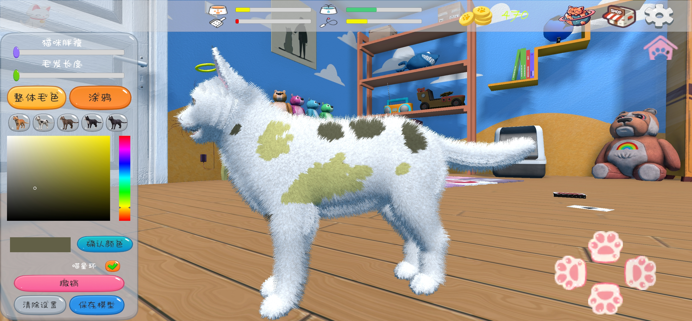

# 个人游戏开发实现作品集
# 目录
- [1.游戏简介](#游戏简介)
- [2.策划思路](#策划思路)
- [3.技术路线](#技术路线)
# 游戏简介

  
爪印（PawPrint）是写给那些现实生活中失去自己爱猫人群的治愈经营游戏。无论猫咪是自然离世、生病去世、亦或是无声无息的离开，喵星人带给人的温暖永远不会消失。希望通过这个works可以带给人们慰藉，世界破破烂烂，小猫缝缝补补。 
PawPrint is a healing game for people who have lost their cats in real life. Whether your cat dies naturally, gets sick, or leaves without a word, the warmth that cats bring to you will never die. I hope this works can bring people comfort, the world is in tatters, and kittens are mending.

# 策划思路
策划路线：以休闲运营为主调，设计家园场景和喵星球场景。在家园场景中实现喂养清洁陪伴、DIY自定义猫形象、日记记录等功能，喵星球场景中实现自由探索功能。以手游为目标，后期移植pc。将受众人群的心理期待为主线，尽可能多的体现人与猫之间的纽带，弱化人的控制，尽可能多的还原猫咪日常状态。  
Planning route: Focus on leisure operation, design home scene and Meow planet scene. In the home scene, the functions of feeding and cleaning, DIY custom cat image, diary recording and so on are realized, and the function of free exploration is realized in the cat planet scene. Target mobile games as the target, later transplant pc. The goal is to take the psychological expectations of the audience as the target, to reflect the bond between people and cats as much as possible, weaken the control of people, and restore the daily state of cats as much as possible.  

# 技术路线
